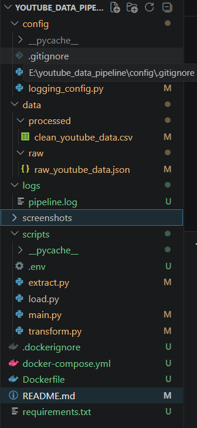
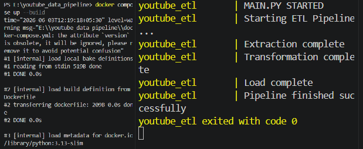
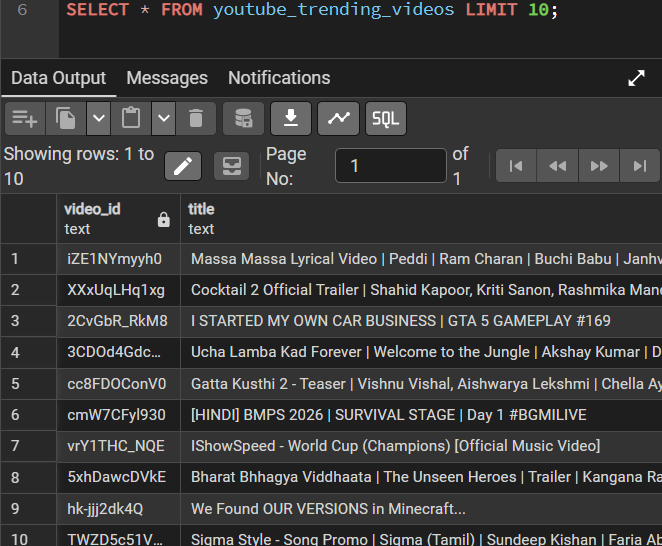
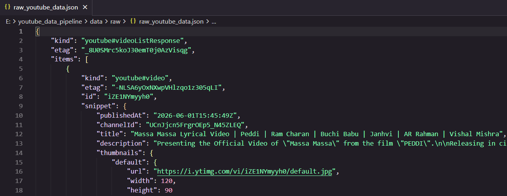
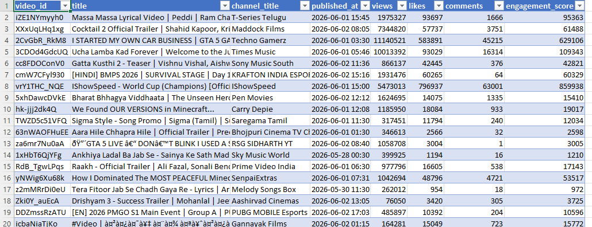

# YouTube Data Engineering Pipeline

## Overview

This project is a production-style ETL (Extract, Transform, Load) pipeline that collects trending YouTube video data using the YouTube Data API v3, transforms the data using Pandas, and loads it into PostgreSQL.

The project is fully containerized using Docker and Docker Compose for reproducible deployment and execution.

---

## Architecture

```text
YouTube Data API
        ↓
     Extract
        ↓
    Transform
        ↓
   PostgreSQL
        ↓
Analytics / Reporting
```

### Containerized Architecture

```text
Docker Compose
├── ETL Container
└── PostgreSQL Container
```

---

## Tech Stack

* Python
* Pandas
* PostgreSQL
* SQLAlchemy
* Psycopg2
* Docker
* Docker Compose
* YouTube Data API v3
* Logging
* Environment Variables (.env)

---

## Project Structure

```text
youtube-data-engineering-pipeline/
│
├── config/
│   ├── config.py
│   └── logging_config.py
│
├── data/
│   ├── raw/
│   └── processed/
│
├── logs/
│
├── scripts/
│   ├── extract.py
│   ├── transform.py
│   ├── load.py
│   └── main.py
│
├── Dockerfile
├── docker-compose.yml
├── requirements.txt
└── README.md
```

---

## ETL Workflow

### Extract

* Connects to YouTube Data API v3
* Retrieves trending videos from India
* Stores raw response as JSON

### Transform

* Converts JSON into Pandas DataFrame
* Cleans and validates data
* Converts numeric fields
* Creates engagement metrics
* Removes duplicates

### Load

* Loads transformed data into PostgreSQL
* Creates analytics-ready tables

---

## Docker Deployment

### Build and Run

```bash
docker compose up --build
```

### Run Locally

```bash
python -m scripts.main
```

---

## Screenshots

### Project Structure



### Docker Compose Execution



### PostgreSQL Output



### Raw JSON Data



### Processed CSV Data



---

## Future Improvements

* Apache Airflow Scheduling
* BigQuery Integration
* Power BI Dashboard
* CI/CD Pipeline
* Cloud Deployment

---

## Author

**Vijay Bhaskar**

Data Analytics | Data Engineering | Data Science
